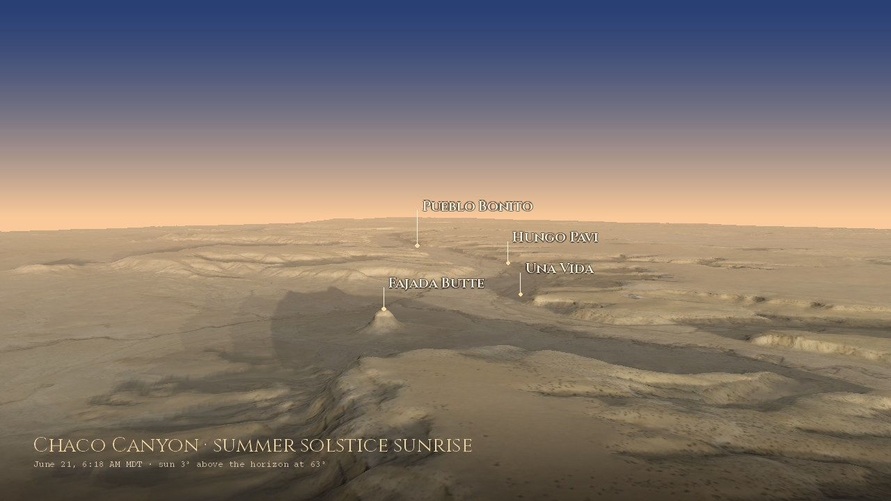

# SOLSTICE

> *The canyon aligned its stones to the sky. We aligned our data to the canyon.*

**[brooksgroves.com/solstice](https://brooksgroves.com/solstice/)**: the sky over Chaco Canyon, computed against the real skyline.



The people who built Chaco's great houses watched where the Sun came up along the horizon, and some of what they built still lines up with it. SOLSTICE follows the same sky over the same canyon. It is careful about two things the first version got wrong: the skyline (canyon walls, not a flat horizon) and the facts.

---

## What's on the page

| Section | What it shows |
|---|---|
| **The flyover** | A forge3d flight down the canyon at summer solstice sunrise: Fajada Butte, Una Vida, Hungo Pavi, Chetro Ketl, Pueblo Bonito, Kin Kletso, Peñasco Blanco. USGS lidar terrain, NAIP aerial photography, the Sun where it really is. |
| **Right now** | The live Sun and Moon over Chaco (computed in the browser), whether Pueblo Bonito is in sunlight or still behind the canyon wall, today's sunrise over the real skyline, and the next solstice or equinox. |
| **The horizon calendar** | The actual skyline from each of eight sites, with every sunrise (or sunset) of the year on it, the two solstices, today, and the Moon's rising limits at major and minor standstills. |
| **Two dawns, one camera** | The same forge3d view at the summer and winter solstice sunrises. |
| **The Sun Dagger and the Moon** | Fajada Butte's light markers, and where we are in the Moon's 18.6-year cycle (just past the major standstill of 2024–25; next minor standstill around 2034). |
| **Sight lines** | A map with the solstice sunrises, today's sunrise and the major-standstill moonrises drawn from any site. |
| **The places** | Eleven sites with fact-checked notes, verified coordinates and honest sky claims. |

---

## Corrections (October 2026)

The April version had some things wrong. They're fixed, and listed here because they're instructive:

- **The Casa Rinconada "alignment monitor" could never switch on.** It compared each day's sunrise to 66.5° and promised to light up near the June solstice. But 66.5° is 90° minus the tilt of Earth's axis, not a sunrise direction. At Chaco's latitude the summer solstice Sun rises at about **59.8°** on a flat horizon, and at **61.6°** over Casa Rinconada's own skyline.
- **The Casa Rinconada story itself is contested.** Light through a northeast window does reach a wall niche after solstice sunrise, but the upper wall and window were rebuilt after the 1930–31 excavation, and a roof post would have blocked the beam. The page now says so.
- **The citation was attached to the wrong site.** Sofaer, Sinclair & Doggett (1982) is about lunar markings on **Fajada Butte**, not Casa Rinconada. The Sun Dagger paper is Sofaer, Zinser & Sinclair (1979) in *Science*.
- **Site coordinates were off by 100 m to 4 km.** Wijiji was 4.0 km out, Una Vida 2.7 km, Hungo Pavi 1.4 km. All eleven now come from OpenStreetMap and Wikipedia and were checked against 0.6 m NAIP aerial photos.
- **The supernova pictograph is at Peñasco Blanco**, at the west end of the canyon, not "near Fajada Butte."
- **The Great North Road** runs about 50 km from Pueblo Alto to Kutz Canyon. It is "more than two-thirds not a north road" by one careful measure. It is not "fifty miles, true north." The made-up road lines are gone from the map.
- **The Moon's phase** was guessed from the percentage lit alone, so it couldn't tell waxing from waning (a 28% Moon was called "First Quarter"). It now uses the Moon's elongation.
- **Time zone**: Chaco keeps Mountain Time *with* daylight saving; the old code said MST = UTC−6.

---

## How it works

```
solstice/
├── index.html               # the page: one file, no build step
├── fetch_solstice.py        # daily: data/sky.json
├── data/
│   ├── sites.json           # 11 sites: verified coordinates, fact-checked notes
│   ├── horizons.json        # each site's skyline, 0.25° steps (tools/horizon.py)
│   └── sky.json             # today's sky, the year's sunrise calendar, Moon, seasons
├── tools/
│   ├── prep_data.py         # fetch 3DEP terrain + NAIP imagery (runs on Actions)
│   ├── horizon.py           # skylines from the terrain
│   ├── render.py            # forge3d stills and the flyover
│   ├── osm_sites.py         # coordinate checks against aerial photos
│   └── fonts/               # Cinzel, Crimson Text, Courier Prime (OFL)
├── assets/                  # renders: stills, flyover video
├── vendor/                  # astronomy-engine (MIT), for the live sky
└── .github/workflows/
    ├── update-solstice.yml  # daily sky
    ├── prep-data.yml        # terrain + imagery → prep-data branch
    └── render.yml           # forge3d renders on GitHub's CPUs
```

**Skylines.** For each site, `tools/horizon.py` marches outward along every azimuth (0.25° steps) over USGS 3DEP elevation: 5 m in the canyon, 30 m out to 80 km. It keeps the highest elevation angle, allowing for Earth's curvature and standard refraction (k = 0.13). As a check, Fajada Butte's summit comes out at 2,018 m; the published figure is 2,019 m.

**The daily sky.** `fetch_solstice.py` (PyEphem) finds the moment the Sun's upper limb clears each site's skyline: today, every third day of the year for the calendar, and on the solstices. It also computes the Moon's phase and the position of the Moon's node, which sets the 18.6-year standstill cycle. Its flat-horizon sunrise agrees with PyEphem's standard sunrise and with astronomy-engine to the minute. GitHub Actions runs it once a day at 12:41 UTC.

**The renders.** `tools/render.py` drives forge3d 1.40.1's terrain viewer headless: Mesa's llvmpipe Vulkan driver under Xvfb, so it runs on GitHub's CPUs with no GPU. The terrain is the 5 m lidar DEM, lightly smoothed because the viewer meshes at most 2048 vertices across. The colour is NAIP 2022, graded after the forge3d Bryce Canyon example. The Sun comes from forge3d's solar calculator for the date and minute named on each image. The flyover is split across parallel Actions jobs and stitched with ffmpeg. Two viewer behaviours worth knowing:
- The viewer won't tilt the camera flatter than 5° below horizontal. It raises the camera instead, and `effective_eye()` copies that so labels land where the terrain is.
- With lighting off, the viewer uses a simpler shader that flattens heights.

**Live sky.** The page computes the Sun and Moon every 30 seconds with [astronomy-engine](https://github.com/cosinekitty/astronomy). It checks the Sun against Pueblo Bonito's skyline to say whether the great house is in sunlight yet.

### Run it

```bash
pixi install
pixi run fetch                       # data/sky.json (needs data/horizons.json)

# terrain, skylines and renders need the prep data (Actions → "Prep render data")
git fetch origin prep-data && mkdir -p prep && git archive FETCH_HEAD | tar -x -C prep
pip install forge3d==1.40.1 rasterio scipy ephem pillow
python tools/horizon.py --prep prep
python tools/render.py stills --prep prep --out assets
```

Or run **Actions → Render with forge3d** to make everything on GitHub.

---

## Sources

- Sofaer, Zinser & Sinclair (1979). [A unique solar marking construct](https://doi.org/10.1126/science.206.4416.283). *Science* 206.
- Sofaer, Sinclair & Doggett (1982). [Lunar markings on Fajada Butte, Chaco Canyon](https://solsticeproject.org/wp-content/uploads/2021/12/20-lunarfajada2028198229.pdf). In *Archaeoastronomy in the New World*.
- High Altitude Observatory: [Casa Rinconada](https://www2.hao.ucar.edu/education/prehistoric-southwest/casa-rinconada); [the supernova pictograph](https://www2.hao.ucar.edu/education/prehistoric-southwest/supernova-pictograph).
- Exploratorium: [Pueblo Bonito](https://annex.exploratorium.edu/chaco/HTML/bonito.html).
- Phillips: [The Chaco Meridian: a skeptical analysis](https://www.unm.edu/~dap/meridian/meridian-text.html).
- [Lunar standstill](https://en.wikipedia.org/wiki/Lunar_standstill); USDA Forest Service, [Chimney Rock and the major lunar standstill](https://fs.usda.gov/r02/sanjuan/recreation/discover-history/northern-major-lunar-standstill).
- Data: [USGS 3DEP](https://www.usgs.gov/3d-elevation-program); USDA NAIP via [Microsoft Planetary Computer](https://planetarycomputer.microsoft.com/dataset/naip); OpenStreetMap.
- Software: [forge3d](https://github.com/milos-agathon/forge3d) by Milos Popovic, [astronomy-engine](https://github.com/cosinekitty/astronomy), [PyEphem](https://rhodesmill.org/pyephem/), [Leaflet](https://leafletjs.com).

Chaco Canyon is the ancestral homeland of the Pueblo peoples and the Diné, and a sacred place to them today.

---

*Built by [Brooks Groves](https://brooksgroves.com) · April 2026, rebuilt October 2026*
